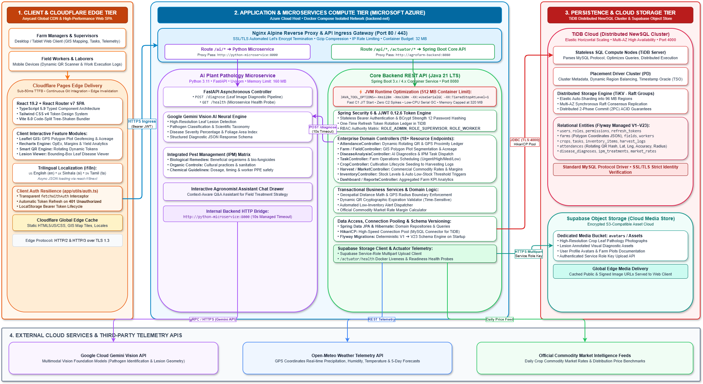
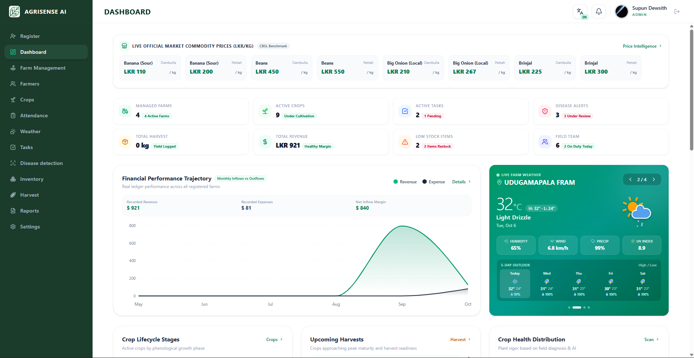
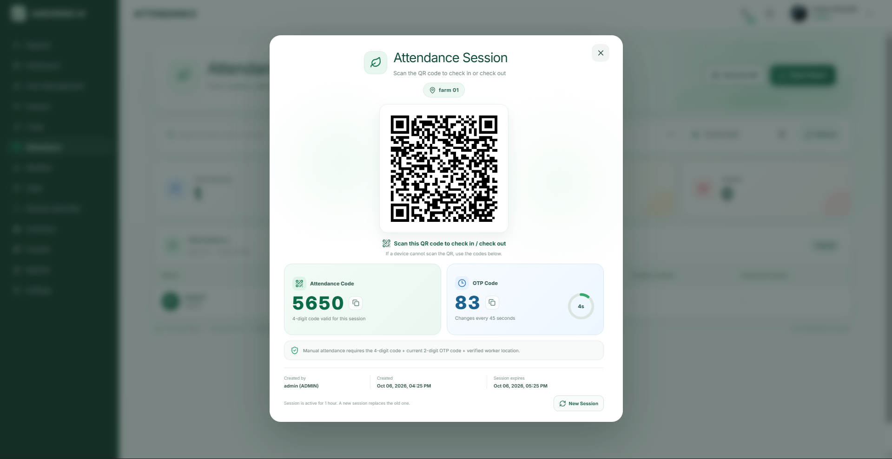
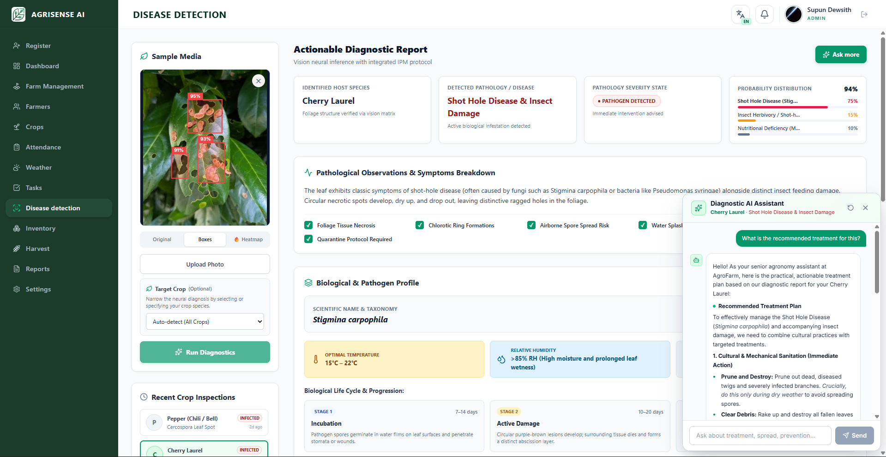
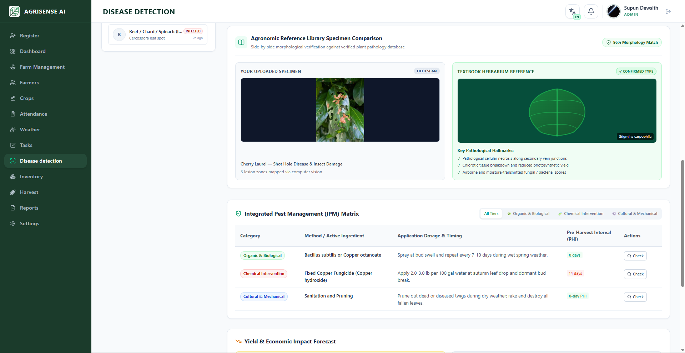
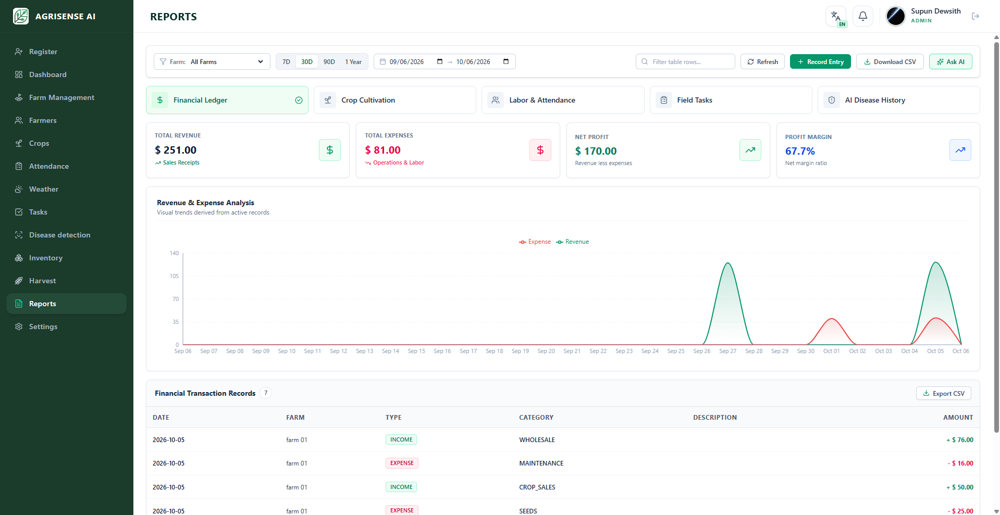
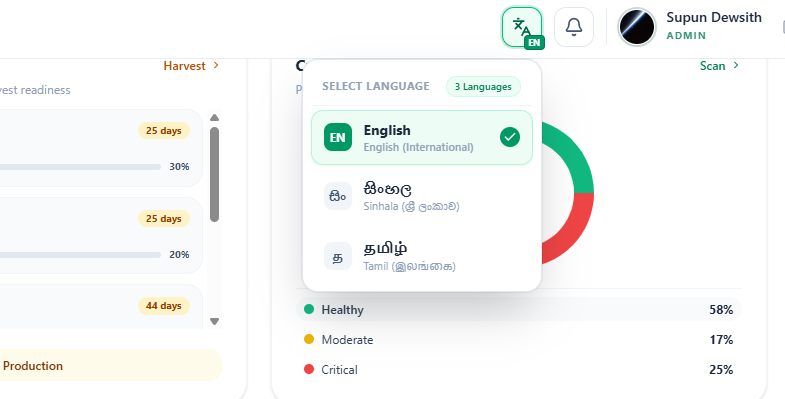

# AgriSense AI integrated Management System — Architectural Overview & System Specification

[](https://adoptium.net/)
[](https://spring.io/projects/spring-boot)
[](https://react.dev/)
[](https://reactrouter.com/)
[](https://www.typescriptlang.org/)
[](https://en.pingcap.com/tidb/)
[](https://azure.microsoft.com/)
[](https://pages.cloudflare.com/)
[](https://fastapi.tiangolo.com/)
[](https://tailwindcss.com/)
[](https://www.docker.com/)
[](#9-production-deployment--client-handover-status)
[](#9-production-deployment--client-handover-status)
[](https://github.com/Supun-Dewsith/agrofarm-backend)
[](https://github.com/Supun-Dewsith/agrofarm-web)

---

## Executive Summary

The **AgriSense Management System** is an enterprise-grade, cloud-native precision agriculture and farm operations management platform. The platform bridges the gap between field-level farming activities and operational leadership by unifying **geospatial GIS plot mapping**, **time-sensitive dynamic QR workforce attendance**, **AI-driven plant pathology diagnostics**, **crop lifecycle tracking**, and **commodity market intelligence** into a decoupled, highly scalable architecture.

The platform is deployed across **Cloudflare Pages** (global edge delivery for the web client) and **Microsoft Azure** (scalable backend services and reverse proxy), backed by **TiDB (Distributed NewSQL)** for elastic horizontal scalability and strong ACID guarantees, and fine-tuned with **JVM runtime optimizations** for minimal footprint and low response latency.

> 📦 **Source Code Repositories:**
> - ⚙️ **Backend API & AI Services:** [https://github.com/Supun-Dewsith/agrofarm-backend.git](https://github.com/Supun-Dewsith/agrofarm-backend.git)
> - 💻 **Frontend Web Portal (SPA):** [https://github.com/Supun-Dewsith/agrofarm-web.git](https://github.com/Supun-Dewsith/agrofarm-web.git)

---

## Visual Tour & System Screenshots Preview

> 📸 **Quick Reference:** Place your images inside the [`screenshots/`](screenshots/) folder with the referenced file names. They will automatically render in this document.

| Feature / Interface | File Path | Status |
| :--- | :--- | :--- |
| **System Architecture Diagram** | [`screenshots/architecture_diagram.png`](screenshots/architecture_diagram.png) | High-Level Cloud Topology |
| **Executive Dashboard** | [`screenshots/dashboard.png`](screenshots/dashboard.png) | Real-time KPI & Weather Carousel |
| **GIS Farm & Field Mapping** | [`screenshots/gis_farm_mapping.png`](screenshots/gis_farm_mapping.png) | Leaflet Geofence & Plot Segmentation |
| **Smart Dynamic QR Attendance** | [`screenshots/smart_attendance_qr.png`](screenshots/smart_attendance_qr.png) | Rotating QR & Live Headcount |
| **AI Plant Pathology Diagnostics** | [`screenshots/ai_disease_detection.png`](screenshots/ai_disease_detection.png) | Leaf Lesion & Confidence Breakdown |
| **Integrated Pest Management (IPM)** | [`screenshots/disease_ipm_matrix.png`](screenshots/disease_ipm_matrix.png) | Chemical / Organic Matrix & AI Chat |
| **Crop Lifecycle Management** | [`screenshots/crop_lifecycle.png`](screenshots/crop_lifecycle.png) | Variety & Growth Milestone Tracker |
| **Task & Workforce Management** | [`screenshots/task_management.png`](screenshots/task_management.png) | Priority Workflow & Assignee Board |
| **Inventory & Supply Monitor** | [`screenshots/inventory_management.png`](screenshots/inventory_management.png) | Stock Depletion & Low-Stock Alerts |
| **Harvest & Market Rates** | [`screenshots/harvest_market_rates.png`](screenshots/harvest_market_rates.png) | Yield Logs vs Official Commodity Prices |
| **Meteorological Forecast** | [`screenshots/weather_forecast.png`](screenshots/weather_forecast.png) | 5-Day Agro-Weather Forecast |
| **Financial & Productivity Reports** | [`screenshots/reports_analytics.png`](screenshots/reports_analytics.png) | Exportable PDF/Excel Audit Sheets |
| **Trilingual Interface (i18n)** | [`screenshots/multilingual_interface.png`](screenshots/multilingual_interface.png) | English, Sinhala & Tamil Switching |
| **Cloud Infrastructure (Azure / TiDB)** | [`screenshots/azure_tidb_deployment.png`](screenshots/azure_tidb_deployment.png) | Cloud Infrastructure & Cluster Status |

---

## Table of Contents

1. [Global System Architecture](#1-global-system-architecture)
2. [Cloud Infrastructure & Hosting Strategy](#2-cloud-infrastructure--hosting-strategy)
3. [JVM Performance Optimization & Resource Containment](#3-jvm-performance-optimization--resource-containment)
4. [Distributed Data Layer (TiDB & Flyway)](#4-distributed-data-layer-tidb--flyway)
5. [Frontend Web Application Specification & Visual Walkthrough](#5-frontend-web-application-specification--visual-walkthrough)
6. [Backend API & AI Microservice Specification](#6-backend-api--ai-microservice-specification)
7. [Core REST API Directory](#7-core-rest-api-directory)
8. [Security & Role-Based Access Control (RBAC)](#8-security--role-based-access-control-rbac)
9. [Production Deployment & Client Handover Status](#9-production-deployment--client-handover-status)

---

## 1. Global System Architecture

<p align="center">
  
  <br />
  <em>Figure 1: High-Level Multi-Tier Architecture across Cloudflare Pages, Microsoft Azure, and TiDB Cloud</em>
</p>

The following diagram illustrates the end-to-end data flow from client requests through global CDNs, cloud infrastructure, microservices, and distributed persistence:

```
                                 ┌──────────────────────────────────────────────┐
                                 │              Web & Mobile Clients            │
                                 │   (Farm Managers, Supervisors, Agronomists)  │
                                 └──────────────────────┬───────────────────────┘
                                                        │
                      ┌─────────────────────────────────┴─────────────────────────────────┐
                      │                                                                   │
                      ▼ Static Assets & Web SPA                                           ▼ REST & AI API Traffic
        ┌───────────────────────────┐                                       ┌───────────────────────────┐
        │      Cloudflare Pages     │                                       │      Microsoft Azure      │
        │   (Global Edge Network)   │                                       │     (Cloud VM / Linux)    │
        │  • React 19 SPA           │                                       │                           │
        │  • Vite 8 Assets          │                                       │   ┌───────────────────┐   │
        │  • Tri-lingual i18n JSONs │                                       │   │   Nginx Reverse   │   │
        │  • Zero-latency Edge CDN  │                                       │   │       Proxy       │   │
        └───────────────────────────┘                                       │   │  (SSL / Gzip / RL)│   │
                                                                            │   └─────────┬─────────┘   │
                                                                            │             │             │
                                                                            │   ┌─────────┴─────────┐   │
                                                                            │   │ /api/*, /actuator │   │
                                                                            │   ▼                   ▼   │
                                                                            │ ┌───────────────┐ ┌─────┴───────┐
                                                                            │ │  Spring Boot  │ │ Python AI   │
                                                                            │ │  Core Backend │ │ Microservice│
                                                                            │ │  (Java 21 LTS)│ │ (FastAPI +  │
                                                                            │ │  • JVM Tuned  │ │  Gemini)    │
                                                                            │ └───────┬───────┘ └─────────────┘
                                                                            └─────────┼─────────────────┘
                                                                                      │
                                                    ┌─────────────────────────────────┴──────────────────┐
                                                    ▼                                                    ▼
                                     ┌─────────────────────────────┐                      ┌─────────────────────────────┐
                                     │   TiDB Distributed NewSQL   │                      │   Supabase Object Storage   │
                                     │  (Cloud Distributed Cluster)│                      │  (Encrypted Media Storage)  │
                                     │  • Horizontal Scalability   │                      │  • Plant Pathology Imagery  │
                                     │  • Strong ACID Transactions │                      │  • User Avatars & Profile   │
                                     │  • Automated Flyway V1-V23  │                      │  • Audit Attachments        │
                                     └─────────────────────────────┘                      └─────────────────────────────┘
```

---

## 2. Cloud Infrastructure & Hosting Strategy

<p align="center">
  
  <br />
  <em>Figure 2: Cloud Infrastructure Topology — Containerized backend on Microsoft Azure and TiDB Distributed Cluster</em>
</p>

### Frontend: Cloudflare Pages
* **Edge CDN Distribution:** Global distribution via Cloudflare's Anycast edge network, guaranteeing sub-50ms Time-to-First-Byte (TTFB) across all geographies.
* **Continuous Deployment:** Managed with the `@cloudflare/vite-plugin` and Cloudflare Wrangler CLI. Pull-request previews and instantaneous production rollback capabilities.
* **Edge Asset Routing:** HTML5 fallback push-state routing for single-page applications without custom server redirection logic.

### Backend: Microsoft Azure
* **Compute Infrastructure:** Provisioned inside a secure Microsoft Azure cloud instance (Linux VM / Azure App Service / Azure Container Instances) running an orchestrated Docker multi-container stack.
* **Reverse Proxy Ingress:** An **Nginx Alpine** proxy terminates SSL/TLS (Let's Encrypt automated certificates), manages HTTP/2 negotiation, applies Gzip compression, and multiplexes traffic:
  * `/api/*` & `/actuator/*` $\rightarrow$ Forwarded internally to the Spring Boot REST backend (`agrofarm-backend:8080`).
  * `/ai/*` $\rightarrow$ Forwarded internally to the Python FastAPI microservice (`python-microservice:8000`).
* **Container Isolation:** Internal private bridge network (`backend-net`) prevents direct public exposure of database credentials and backend microservices.

### Object & Media Storage: Supabase Storage
* Encrypted, cloud-native S3-compatible bucket dedicated to storing high-resolution leaf pathology photographs, user profile pictures, and farm documentation with role-authenticated upload policies.

---

## 3. JVM Performance Optimization & Resource Containment

To run seamlessly inside resource-constrained Azure cloud environments without sacrificing throughput, the Spring Boot application utilizes dedicated **Java 21 JVM optimization parameters**:

```dockerfile
# Production JVM Flags applied inside Docker Compose:
JAVA_TOOL_OPTIONS=-Xms128m -Xmx320m -XX:+UseSerialGC -XX:TieredStopAtLevel=1
```

### Breakdown of Tuning Parameters:

| Optimization Flag | Technical Mechanism | Operational Benefit |
| :--- | :--- | :--- |
| `-Xms128m` | Sets initial heap allocation to 128 MB | Prevents aggressive early allocation from host OS memory. |
| `-Xmx320m` | Hard-caps maximum heap allocation at 320 MB | Ensures the process stays safely within the **512 MB Docker container limit** without triggering OOM (Out Of Memory) killer kills. |
| `-XX:+UseSerialGC` | Activates the Serial Garbage Collector | Eliminates multi-threaded GC thread overhead, minimizing CPU usage on single-core / low-vCPU cloud instances. |
| `-XX:TieredStopAtLevel=1` | Restricts JIT compilation to C1 (Client Compiler) level 1 | Drastically slashes JVM cold start time, eliminates heavy C2 compiler CPU spikes during startup, and reduces code cache memory usage. |

### Container Resource Budgets:

```yaml
services:
  agrofarm-backend:
    deploy:
      resources:
        limits:
          memory: 512M
  python-microservice:
    deploy:
      resources:
        limits:
          memory: 160M
  nginx:
    deploy:
      resources:
        limits:
          memory: 32M
```

---

## 4. Distributed Data Layer (TiDB & Flyway)

### Distributed NewSQL Persistence: TiDB
Rather than a traditional monolithic database, the system is backed by **TiDB (Distributed SQL)**:
* **Horizontal Scalability:** Decouples compute from storage, allowing auto-sharding and seamless elastic scaling as farm telemetry, sensor logs, and attendance scans increase.
* **Strict ACID Compliance:** Provides strong multi-record transactional consistency across financial logs, task allocation, and worker check-ins.
* **MySQL Protocol Compatibility:** Integrates seamlessly with Spring Boot via standard JDBC drivers while providing cloud distributed fault tolerance and cross-availability-zone failover.

### Automated Flyway Migrations (V1 — V23)
Schema state is deterministically managed through **Flyway**, executing forward migrations on application startup:
* **V1 – V5:** User authentication, role schemas, permissions matrix, farm coordinates, worker profiles.
* **V6 – V12:** Field plot segmentation, crop growth stages, seed and fertilizer inventory catalogs.
* **V13 – V18:** Geofenced QR attendance ledgers, daily check-in verification records, task assignment tables.
* **V19 – V23:** AI pathology diagnosis histories, Integrated Pest Management (IPM) records, commodity market pricing tables, telemetry caches.

---

## 5. Frontend Web Application Specification & Visual Walkthrough

### Tech Stack
* **Repository:** [https://github.com/Supun-Dewsith/agrofarm-web.git](https://github.com/Supun-Dewsith/agrofarm-web.git)
* **Framework:** React 19.2, React Router v7 (SPA Architecture)
* **Language:** TypeScript 5.9
* **Build Engine:** Vite 8.0 with `@cloudflare/vite-plugin`
* **Styling:** Tailwind CSS v4, Vanilla CSS tokens
* **Mapping / GIS:** Leaflet 1.9, React-Leaflet
* **Visualization:** Recharts
* **Icons:** Lucide React
* **QR Engine:** QRCode
* **Localization:** i18next, react-i18next, i18next-http-backend

---

### Module Visual Walkthrough

#### 5.1 Executive Dashboard (`/home/dashboard`)
The central operations cockpit summarizing multi-farm health, real-time KPI metrics, operational expenditure, and satellite weather telemetry.

<p align="center">
  
  <br />
  <em>Figure 3: Executive Dashboard showing operational KPIs, farm weather satellite slideshow, and revenue vs. OpEx curves</em>
</p>

* **Capabilities:** Real-time KPI summaries (Total Farms, Active Workers, Total Crops, Yield Target Margins), interactive farm weather telemetry slideshow, and comparative income vs. expense analytics.

---

#### 5.2 GIS Farm & Field Plot Mapping (`/home/farm-management`)
Interactive geospatial management allowing administrators to trace GPS boundaries and subdivide acreage into designated field plots.

<p align="center">
  
  <br />
  <em>Figure 4: Leaflet-powered GIS mapping interface with polygon boundaries and field plot zoning</em>
</p>

* **Capabilities:** GPS polygon boundary editor, automatic acreage calculation, soil type classification, crop status assignment per plot, and geocoded location queries.

---

#### 5.3 Smart Dynamic QR Attendance & Geofencing (`/home/attendance`)
On-site attendance terminal utilizing dynamic, self-refreshing QR codes paired with GPS radius verification.

<p align="center">
  
  <br />
  <em>Figure 5: Rotating QR code kiosk with live on-site worker ledger and GPS verification</em>
</p>

* **Capabilities:** Auto-refreshing time-sensitive QR code generator, real-time worker proximity checks, on-site personnel headcount, and check-in/out timestamps.

---

#### 5.4 AI Plant Pathology & Disease Diagnostics (`/home/disease-detection`)
Computer-vision-driven crop diagnostic suite providing instant pathogen classification, severity rating, and comprehensive treatment matrices.

<p align="center">
  
  <br />
  <em>Figure 6: Neural plant pathology diagnostic showing leaf lesion analysis and probability metrics</em>
</p>

<p align="center">
  
  <br />
  <em>Figure 7: Integrated Pest Management (IPM) treatment breakdown and interactive agronomy AI consultation drawer</em>
</p>

* **Capabilities:** Image upload with lesion bounding boxes, pathogen taxonomy (scientific name), severity indexing, biological and organic remedy suggestions, chemical dosage guides, and direct task dispatch.

---

#### 5.5 Crop Lifecycle Management (`/home/crops`)
Comprehensive crop tracking spanning from seeding through developmental stages to final harvest.

<p align="center">
  
  <br />
  <em>Figure 8: Cultivation tracking showing growth stages, planting schedules, and expected harvest targets</em>
</p>

* **Capabilities:** Cultivation calendar, projected vs. actual yield metrics, developmental stage filters, and field plot allocation history.

---

#### 5.6 Task Scheduling & Workforce Management (`/home/tasks`, `/home/farmers`)
Operational dispatching tool assigning agricultural duties to supervisors and field laborers with strict priority tiers.

<p align="center">
  
  <br />
  <em>Figure 9: Agricultural operations dispatch board with priority badges and worker assignments</em>
</p>

* **Capabilities:** Task prioritization (Low, Medium, High, Urgent), workflow states (Pending, In Progress, Completed), worker directory with farm plot assignment history.

---

#### 5.7 Inventory & Resource Monitoring (`/home/inventory`)
Agricultural consumables and heavy equipment monitoring with automatic threshold notifications.

<p align="center">
  
  <br />
  <em>Figure 10: Agricultural resource ledger tracking seeds, chemicals, fertilizers, and machinery thresholds</em>
</p>

* **Capabilities:** Real-time stock counters, minimum replenishment alert levels, and historical consumption auditing linked to specific tasks and plots.

---

#### 5.8 Harvest Logging & Commodity Market Intelligence (`/home/harvest`)
Harvest tracking compared against official government commodity pricing to evaluate commercial profitability.

<p align="center">
  
  <br />
  <em>Figure 11: Harvest yield records evaluated against official commodity market rates for margin optimization</em>
</p>

* **Capabilities:** Batch weight logs (kg/tons), quality grades, comparative profitability margin charts, and market price trend indicators.

---

#### 5.9 Meteorological Telemetry & Agro-Forecasting (`/home/weather`)
Microclimate telemetry and 5-day weather forecasts generated for each registered farm plot.

<p align="center">
  
  <br />
  <em>Figure 12: Coordinates-specific meteorological forecast screen with agro-climatic danger alerts</em>
</p>

* **Capabilities:** Temperature, humidity, precipitation probability, wind speed, and automated agricultural hazard alerts (frost, dry spells, heavy rains).

---

#### 5.10 Operational Reports & Financial Analytics (`/home/reports`)
Executive reporting suite providing exportable audits of farm productivity, labor efficiency, and financial health.

<p align="center">
  
  <br />
  <em>Figure 13: Exportable farm analytics dashboard showing productivity ratios and financial statements</em>
</p>

* **Capabilities:** Field efficiency metrics, labor attendance audits, resource utilization breakdown, and exportable PDF/Excel reporting.

---

#### 5.11 Trilingual Localization (i18n)
Native language support enabling accessibility across diverse agricultural worker communities.

<p align="center">
  
  <br />
  <em>Figure 14: Multilingual interface toggle supporting English, Sinhala (සිංහල), and Tamil (தமிழ்)</em>
</p>

* **Capabilities:** Instantaneous language switching powered by `react-i18next` with structured locale JSON files for **English (`en`)**, **Sinhala (`si`)**, and **Tamil (`ta`)**.

---

### Network Layer & Resilient Authentication
The frontend implements an automated, transparent token lifecycle in `app/utils/auth.ts`:

```
User Action  ──►  fetchWithAuth(url)
                       │
                       ├─► Appends Authorization: Bearer <AccessToken>
                       │
                       ▼
                 Backend Response
                       │
             ┌─────────┴─────────┐
             │                   │
         Status 200         Status 401 (Token Expired)
             │                   │
      Returns Data         Calls /api/auth/refresh with Refresh Token
                                 │
                         ┌───────┴───────┐
                         │               │
                      Success         Failure
                         │               │
                 Re-attempts API    Purges credentials
                     Request        & Redirects to /login
```

---

## 6. Backend API & AI Microservice Specification

### Core Tech Stack
* **Repository:** [https://github.com/Supun-Dewsith/agrofarm-backend.git](https://github.com/Supun-Dewsith/agrofarm-backend.git)
* **Language & Runtime:** Java 21 LTS (Eclipse Temurin)
* **Framework:** Spring Boot 3.x / 4.x
* **Security:** Spring Security 6, JJWT 0.12.6, BCrypt
* **ORM & Persistence:** Spring Data JPA, Hibernate, HikariCP
* **Database Driver:** MySQL / MariaDB connector (optimized for TiDB Distributed SQL)
* **Microservices & AI:** Python 3.11, FastAPI, Uvicorn, Google Gemini Vision API

### AI Plant Pathology Microservice (`python-microservice`)
* **Framework:** FastAPI running on Uvicorn.
* **Engine:** Google Gemini Vision (`gemini-1.5-flash` / vision endpoints).
* **Pipeline:**
  1. The Spring Boot backend passes the validated leaf image payload to the Python microservice over internal HTTP.
  2. The service formats a structured agricultural prompt enforcing JSON output schemas.
  3. Returns:
     * Identified Pathogen & Scientific Name
     * Diagnosis Confidence Score
     * Disease Severity Level & Affected Foliage Percentage
     * **Integrated Pest Management (IPM) Matrix:**
       * Biological remediation methods
       * Organic / Cultural practices
       * Targeted chemical recommendations (dosage & precautions)
     * Preventive field practices to prevent fungal/bacterial spread.

---

## 7. Core REST API Directory

The backend exposes over 18 resource controllers categorized below:

| Controller | Base Path | Core Responsibilities |
| :--- | :--- | :--- |
| `AuthController` | `/api/auth` | User login, token refresh rotation, logout, credential validation. |
| `UserManagementController` | `/api/users` | User registration, credential provisioning, role assignment. |
| `WorkerController` | `/api/workers` | Worker profiles, contact details, farm plot allocation history. |
| `FarmController` | `/api/farms` | Farm CRUD, boundary coordinates, farm metadata. |
| `FieldController` | `/api/fields` | Sub-field plot division, acreage, soil types, crop assignment. |
| `FarmLocationSearchController` | `/api/farms/location` | Geospatial geocoding, coordinate distance queries. |
| `CropController` | `/api/crops` | Crop lifecycle records, growth stages, harvest targets. |
| `AttendanceController` | `/api/attendance` | Dynamic QR code generation, worker check-in, geofence verification. |
| `TaskController` | `/api/tasks` | Farm task dispatch, priority levels, assignment, status updates. |
| `DiseaseAnalysisController` | `/api/disease-analysis`| Image upload, Python AI invocation, IPM generation, diagnosis history. |
| `InventoryController` | `/api/inventory` | Consumable tracking, threshold alert dispatch, consumption logs. |
| `HarvestController` | `/api/harvests` | Yield logging, batch grading, production cost records. |
| `OfficialMarketController` | `/api/market` | Commodity pricing feeds, comparative margin analyses. |
| `WeatherController` | `/api/weather` | Live farm weather metrics, forecast caches, climate warnings. |
| `DashboardController` | `/api/dashboard` | Aggregated executive KPIs, farm overview summaries. |
| `ReportController` | `/api/reports` | Yield efficiency calculations, labor productivity, audit export. |
| `SettingsController` | `/api/settings` | System-wide configuration, farm parameter adjustments. |
| `NotificationController` | `/api/notifications` | In-app alerts for low stock, urgent tasks, and weather hazards. |

---

## 8. Security & Role-Based Access Control (RBAC)

The system enforces strict multi-tier permissions verified on both the frontend navigation guards and Spring Security method-level annotations (`@PreAuthorize`):

```
                               ┌────────────────────────────────────────────────────────┐
                               │                    Role Hierarchy                      │
                               └───────────────────────────┬────────────────────────────┘
                                                           │
                      ┌────────────────────────────────────┼────────────────────────────────────┐
                      ▼                                    ▼                                    ▼
           ┌─────────────────────┐              ┌─────────────────────┐              ┌─────────────────────┐
           │     ROLE_ADMIN      │              │   ROLE_SUPERVISOR   │              │     ROLE_WORKER     │
           └──────────┬──────────┘              └──────────┬──────────┘              └──────────┬──────────┘
                      │                                    │                                    │
           • Complete System Control            • Field & Crop Operations            • Personal Attendance Log
           • User Onboarding & RBAC             • Task Creation & Scheduling         • Assigned Task Execution
           • Global Financial Reports           • Disease Diagnosis & IPM            • Profile View
           • Farm Boundary Geofencing           • Inventory Consumption Log          • Dynamic QR Scanner
           • System Configuration               • Worker Attendance Oversight
```

### Authentication Mechanics:
1. **Passwords:** Stored exclusively as one-way salted hashes using BCrypt (strength 12).
2. **Access Tokens:** Signed with HMAC-SHA256 (`JJWT`), holding short-lived lifespans (default: 24h).
3. **Refresh Tokens:** Persisted securely in the database with one-time rotation policies.
4. **Seed Administrator:** Automatically seeded into the database on initial boot using configuration environment variables.

---

## 9. Production Deployment & Client Handover Status

AgriSense was built and delivered as a **client requirement-based enterprise group project**, developed to digitize and optimize agricultural workflows, and successfully transitioned into active commercial operations.

### Delivery & Deployment Highlights

* **🟢 Operational Status:** The system is **live in production** and actively accessed by the client to manage multi-farm operations, supervise field labor, and execute AI plant diagnostics.
* **☁️ Cloud Infrastructure:**
  * **Frontend Web Dashboard:** Deployed and served at the edge via **Cloudflare Pages** for global distribution and sub-second UI interactions.
  * **Backend API & Microservices:** Hosted in production on **Microsoft Azure** inside an isolated Docker container stack with an Nginx reverse proxy.
  * **Distributed Database:** Backed by a **TiDB Cloud (Distributed NewSQL)** cluster for elastic scaling, high throughput, and multi-zone ACID transactional consistency.
* **👥 Client Access & Role Provisioning:** Full administrative credentials (`ROLE_ADMIN`) and initial farm accounts were handed over to the client for day-to-day operations.
* **🛠️ Developer Setup & Repositories:** For developers requiring local environment setup guides, `.env.example` templates, Flyway migration files, or automated build scripts, please refer directly to the respective source repositories:
  * ⚙️ **Backend Core & AI Microservice:** [AgriSense Backend Repository](https://github.com/Supun-Dewsith/agrofarm-backend.git)
  * 💻 **Frontend Web Application (SPA):** [AgriSense Web Repository](https://github.com/Supun-Dewsith/agrofarm-web.git)

---

*AgriSense Management System — Engineered for scalability, reliability, and precision agriculture.*
